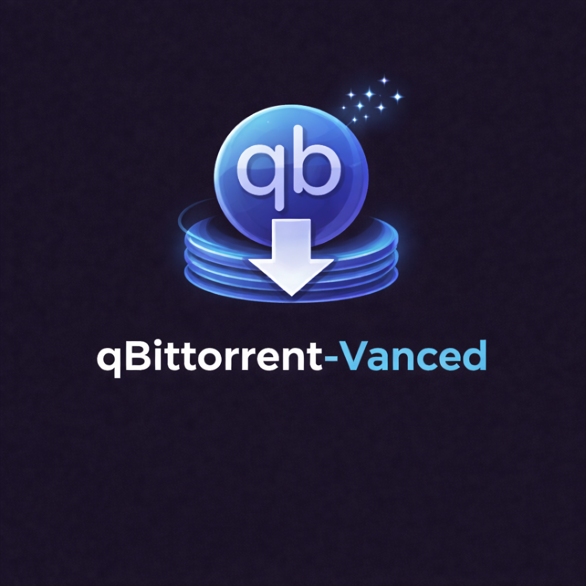

<!-- codex-branding:start -->
<p align="center"></p>

<p align="center">
  
  
  
</p>
<!-- codex-branding:end -->

# qBittorrent Vanced

  

A customized build of [qBittorrent Enhanced Edition](https://github.com/c0re100/qBittorrent-Enhanced-Edition) with a modern dark theme, streamlined interface, and quality-of-life improvements.

Based on qBittorrent Enhanced Edition v5.1.3.10 (which itself is based on [qBittorrent](https://github.com/qbittorrent/qBittorrent) v5.1.3).

## What's Different

### Dark Theme (Catppuccin Mocha)

- Complete Catppuccin Mocha dark theme applied across all widgets, menus, toolbars, dialogs, and the WebUI
- Glassmorphism-inspired styling with subtle transparency and accent colors
- Branded scrollbars, condensed spacing, and polished UI elements throughout

### Green Progress Bars with Shimmer Effect

- Custom-painted progress bars replace the default Qt style
- Green gradient with 3D vertical banding (similar to classic Windows Explorer file transfers)
- Animated shimmer highlight sweeps across active downloads
- Distinct colors for downloading (green), completed (bright green), and stopped/error (muted gray)

### Streamlined Interface

- Removed the Dashboard tab
- Removed the "Filter by" dropdown from the toolbar (search bar filters by name)
- Removed the filters sidebar and status bar by default for a cleaner layout
- Condensed vertical spacing throughout (tab bars, toolbars, table rows, headers, buttons)
- Wider default column sizes so column titles aren't clipped

### Inline Speed Controls

- Download and upload speed displayed directly in the properties tab bar
- Click either button for a dropdown with quick speed limit presets (Unlimited, 10, 20, 50, 100, 200, 500, 1000, 2000, 5000, 10000 KiB/s)
- Real-time display of current speed and active limit

### Sensible Defaults

- Upload speed limited to 20 KiB/s by default (instead of unlimited)
- Torrents stop on completion by default

### Inherited from Enhanced Edition

- Auto ban BitTorrent leechers and unwanted peers (Xunlei, QQDownload, etc.)
- Auto ban unknown peers from private trackers
- Enhanced peer ID/client name detection
- All features from upstream qBittorrent

## Building

### Requirements

- Visual Studio 2022+ with C++ workload
- CMake 3.16+
- vcpkg (included with Visual Studio)

### Windows

```powershell
powershell -ExecutionPolicy Bypass -File build.ps1
```

The build script automatically configures MSVC, vcpkg dependencies, and builds with Ninja.

## License

Licensed under the [GNU General Public License v2.0](https://www.gnu.org/licenses/old-licenses/gpl-2.0.html) (or later), same as upstream qBittorrent.

## Credits

- [qBittorrent](https://github.com/qbittorrent/qBittorrent) - The original open-source BitTorrent client
- [qBittorrent Enhanced Edition](https://github.com/c0re100/qBittorrent-Enhanced-Edition) - Enhanced fork with anti-leecher features
